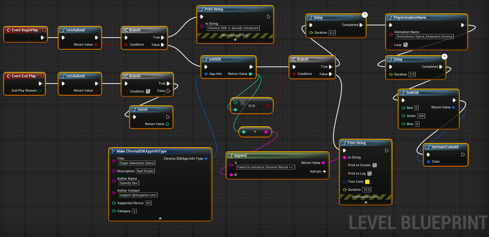

# Deprecated

* Note: Visit the [Chroma Animation Guide](https://chroma.razer.com/ChromaGuide/) to find the latest supported plugin for Chroma RGB.

* Note: Go to [UE4_XDK_SampleApp](https://github.com/razerofficial/UE4_XDK_SampleApp) for the updated UE4 Chroma SDK plugin.

# UE4_4_26_Minimal_Chroma_Project

This repro is an example of the minimal Blueprints needed setup Chroma RGB. See the image below.

Minimal project setup to show Chroma in UE4 4.26

Level Blueprint:

